<p align="center">
  
</p>
<h1 align="center">Diving Center</h1>

<h2>Welcome</h2>

Visit the live website: [Diving Center](https://divingspace-900b5a3db777.herokuapp.com)

Explore the Diving Center Code: [Diving Center GitHub](https://github.com/AmirShkolnik/DivingCenter)

Explore the Diving Center API: [Api GitHub](https://github.com/AmirShkolnik/pp5_api)

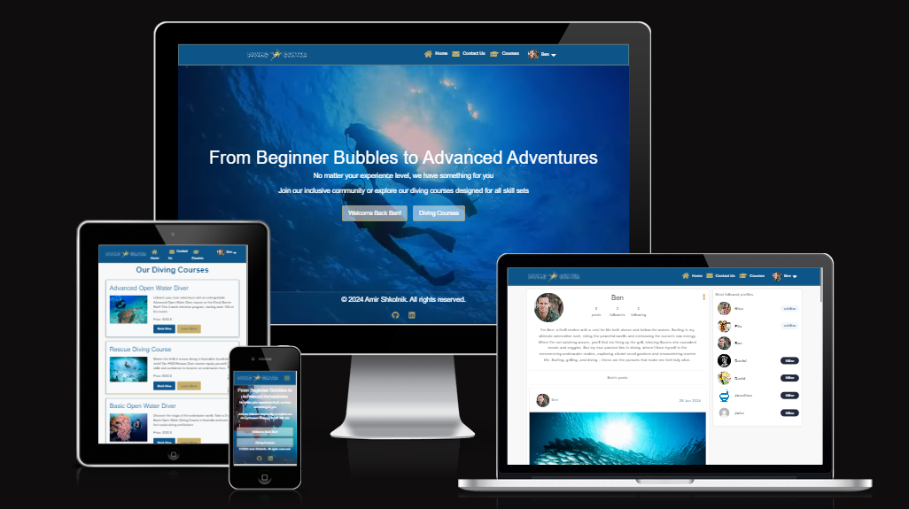

# Introduction

## Diving Center

Welcome to [**Diving Center**](https://divingspace-900b5a3db777.herokuapp.com), your gateway to underwater adventures! From Beginner Bubbles to Advanced Adventures, we cater to all experience levels, offering a diverse range of courses including Advanced Open Water Diver, Rescue Diving, and Basic Open Water Diver. Our inclusive community is designed to connect fellow diving enthusiasts, allowing you to share experiences and discover new diving spots.

### Get Involved

Join our vibrant social media platform to dive into a world of excitement. Whether you're taking your first plunge or you're a seasoned pro, there's a place for you here. Sign up to connect with like-minded divers, share your underwater tales, and explore the depths together.

For our returning divers, welcome back! Sign in to reconnect with your diving buddies, showcase your latest aquatic explorations, and uncover new underwater wonders. At [**Diving Center**](https://divingspace-900b5a3db777.herokuapp.com), we're not just about courses – we're about creating a community where passion for diving thrives. Let's embark on this underwater journey together!

# Table of Contents
- [Introduction](#introduction)
- [Table of Contents](#table-of-contents)
- [Overview](#overview)
- [UX - User Experience](#ux---user-experience)
- [Design](#design)
  - [Colour Scheme](#colour-scheme)
  - [Fonts](#fonts)
    - [Google Fonts](#google-fonts)
- [Project Planning](#project-planning)
  - [Strategy Plane](#strategy-plane)
  - [Agile Methodologies - Project Management:](#agile-methodologies---project-management)
    - [Story Points Allocation](#story-points-allocation)
    - [Sprint Planning Example](#sprint-planning-example)
    - [MoSCoW Prioritization:](#moscow-prioritization)
    - [User Stories, Milestones and Epics](#user-stories-milestones-and-epics)
      - [Users Stories](#users-stories)
      - [Milestones](#milestones)
      - [Epics](#epics)
  - [Scope Plane](#scope-plane)
  - [Structural Plane](#structural-plane)
  - [Skeleton \& Surface Planes](#skeleton--surface-planes)
    - [Wireframes](#wireframes)
    - [Database Schema - Entity Relationship Diagram](#database-schema---entity-relationship-diagram)
      - [Database Schema](#database-schema)
      - [Entity Relationship Diagram (ERD)](#entity-relationship-diagram-erd)
      - [Tables Overview](#tables-overview)
      - [Relationships](#relationships)
    - [Security](#security)
  - [All Existing Features with Screenshots](#all-existing-features-with-screenshots)
    - [CRUD Functionality](#crud-functionality)
  - [Future Features](#future-features)
- [Technology Used](#technology-used)
  - [Frontend](#frontend)
  - [Backend](#backend)
  - [Deployment and Version Control](#deployment-and-version-control)
  - [Development Tools](#development-tools)
  - [Libraries and Frameworks](#libraries-and-frameworks)
  - [Validation Tools](#validation-tools)
  - [Others](#others)
- [Testing](#testing)
- [Deployment](#deployment)
- [Cloning and Forking](#cloning-and-forking)
- [Credits](#credits)

# Overview

Live Version: [**Diving Center**](https://divingspace-900b5a3db777.herokuapp.com)

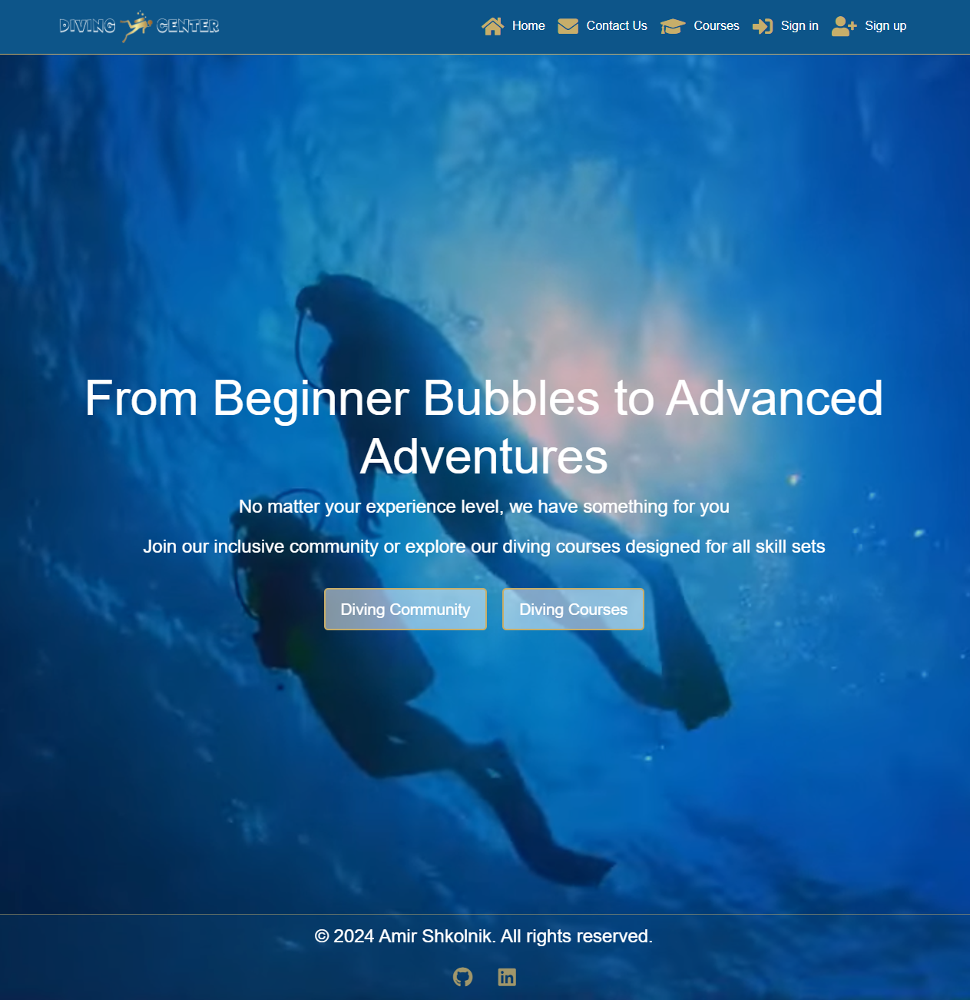

**Diving Center** is a vibrant online platform celebrating the art of scuba diving and fostering a sense of community. It serves as a communal hub for:

- Joining a passionate community of diving enthusiasts and professionals.
- Creating personalized profiles to share underwater experiences and insights.
- Contributing and interacting with engaging content on diving culture.
- Discovering the latest trends, techniques, and best practices in the world of scuba diving.
- Facilitating discussions and exchanges within a supportive diving community

Accessible across various devices and browsers, [**Diving Center**](https://divingspace-900b5a3db777.herokuapp.com) aims to demystify the complexities of scuba diving, making the art of underwater exploration and appreciation accessible to a diverse audience. Whether you're a seasoned divemaster, a diving enthusiast, or a curious newcomer, the platform offers tailored resources to support your journey into the world of diving.

[**Diving Center**](https://divingspace-900b5a3db777.herokuapp.com) envisions fostering a collaborative ecosystem where members can learn, share, and grow together in their love for underwater exploration. By engaging with the platform, users can stay ahead of diving trends, enhance their diving skills, and connect with like-minded enthusiasts. As the platform evolves, future enhancements will include advanced interactive features, further enriching the user experience and community engagement around the shared passion for diving adventures.

# UX - User Experience

The UX design of Diving Center revolves around creating an immersive and engaging experience for diving enthusiasts. With a focus on community, personalization, and seamless navigation, we aim to provide a delightful journey through the world of underwater exploration. Here's a breakdown of our user experience:

- **Intuitive Navigation:** Our user-friendly interface ensures effortless exploration of courses, dive sites, and community contributions, making it easy for users to find their desired content.

- **Responsive Design:** Whether accessing Diving Center from a desktop, tablet, or mobile device, our responsive layout adapts seamlessly, ensuring a consistent and enjoyable experience across all platforms.

- **Engaging Content:** Our course descriptions, dive site reviews, and community posts are crafted to captivate and inform, offering a wealth of knowledge and insights into the art of diving.

- **Personalization:** Users can create personalized accounts, allowing them to save their favorite courses, follow fellow divers, and curate their own collection of diving experiences.

- **Interactive Community:** We foster a vibrant community where users can share their passion, exchange ideas, and engage in discussions through comments, likes, and personal reviews of dive sites and equipment.

- **Seamless Contribution:** Our platform empowers users to contribute their own content, whether it's writing reviews, sharing personal diving stories, or offering tips and recommendations to fellow enthusiasts.

Overall, the UX design of Diving Center aims to create an immersive and inclusive environment where diving lovers can explore, learn, and connect, all while experiencing the thrilling adventures that the underwater world has to offer.

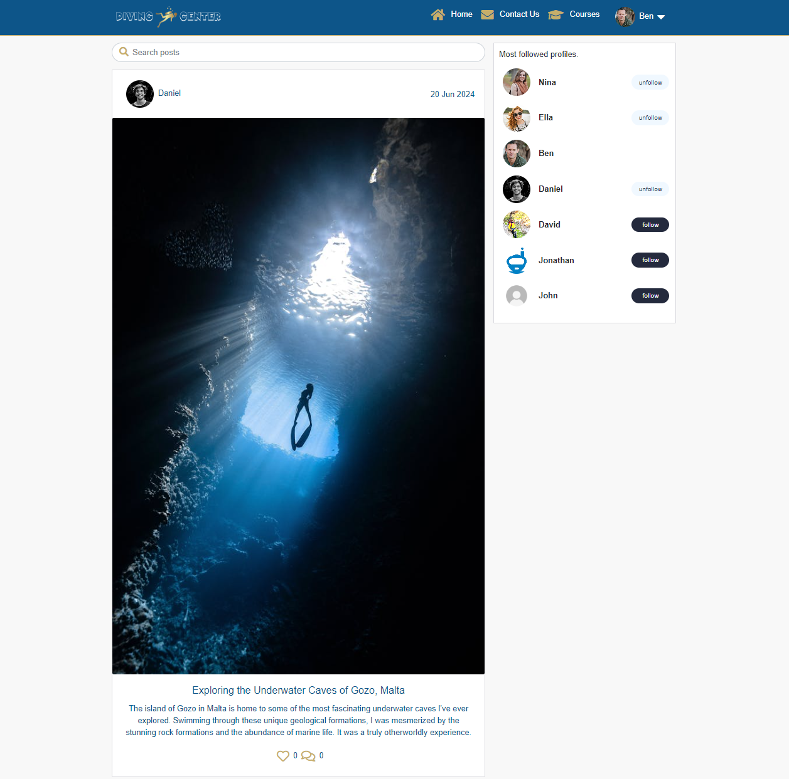

# Design

## Colour Scheme

The color scheme for Diving Center is carefully crafted to evoke a warm, inviting, and diving-inspired atmosphere. Here's a detailed breakdown:

[Colors by looka.com](https://looka.com/editor/188707413) - Colour Scheme for Diving Center website

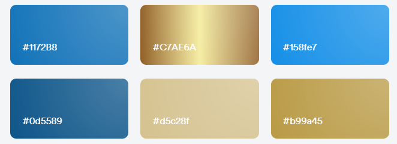

The Diving Center's color scheme is a carefully curated palette that evokes the essence of underwater exploration and marine environments. Here's a unique description of the color scheme:

The Diving Center's visual identity is anchored by a rich array of blues, complemented by warm golden hues and crisp neutrals. This thoughtfully designed color palette creates an immersive digital experience that mirrors the allure of the ocean depths.

At the heart of the scheme is **Ocean Blue (#1172B8)**, a deep, saturated hue that serves as the primary color. This shade evokes the vast expanse of the open sea, instilling a sense of adventure and exploration throughout the website.

**Sunlit Waves (#158FE7)** adds a vibrant, energetic touch to the design. This bright blue, reminiscent of sun-dappled waters, is used for interactive elements and call-to-action buttons, guiding users through their journey on the site.

Providing depth and grounding is **Abyss Blue (#0D5589)**, a darker shade that anchors the design and creates a sense of the mysterious underwater world.

Balancing the cool blues are warm, sandy tones. **Golden Sand (#C7AE6A)** and **Sun-Bleached Shore (#D5C28F)** add warmth and contrast, evoking images of tropical beaches and sun-soaked dive spots. These colors are used for accents and highlights, bringing a touch of sunlight to the oceanic palette.

**Treasure Gold (#B99A45)** serves as a special accent color, perhaps used for premium features or to highlight important information. It adds a touch of luxury and discovery, like finding hidden treasures beneath the waves.

The palette is completed with classic **Black (#000000)** and **White (#FFFFFF)**. These provide sharp contrast and clarity, ensuring excellent readability for text and creating clean spaces within the design.

This unique color scheme not only captures the essence of diving but also enhances usability. The contrast between the deep blues and warm golds creates visual interest and guides users through the site, while the neutral black and white ensure clarity and accessibility. Together, these colors create an immersive digital environment that beckons diving enthusiasts to explore, connect, and dive deeper into their passion.

## Fonts

The font choices for Diving Center are meticulously selected to evoke the essence of underwater exploration and adventure. By harnessing the power of typography, we aim to enhance the user experience and immerse our visitors in the captivating world of diving.

### Google Fonts

**Diving Center** employs fonts from [Google Fonts](doc/fonts/dm-sans.png), specifically the DM Sans family, to create a cohesive and visually appealing design across our platform. This modern, sans-serif typeface offers excellent readability and a clean, professional appearance that aligns perfectly with our diving-themed website.

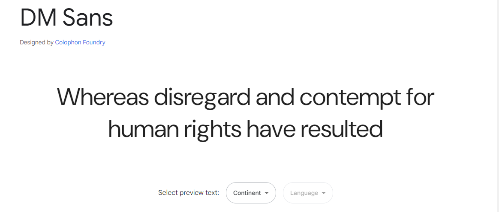

#### DM Sans
- **Usage**: Headings, titles, and emphasis

- **Characteristics**: DM Sans boasts a perfect equilibrium of fluid contours and bold strokes, embodying both approachability and professionalism in its design.

- **Reason for Selection**: The distinctive character of DM Sans encapsulates the spirit of diving exploration – a fusion of adventure and expertise. Its clean yet dynamic style emphasizes key information, guiding divers through our platform while evoking a sense of aquatic wonder and technical proficiency.

[DM Sans on Google Fonts](https://fonts.google.com/specimen/DM+Sans)

By leveraging the crisp legibility of DM Sans, Diving Center crafts a typographic journey that resonates with underwater enthusiasts. Each character, phrase, and paragraph invites users to dive in, discover, and connect with the vast tapestry of marine life, diving techniques, and underwater narratives that make the diving world so captivating. The font's versatility allows for clear communication of both technical diving information and engaging storytelling, creating an immersive digital experience that mirrors the depth and diversity of the ocean itself.

# Project Planning

## Strategy Plane

**Project Overview:**  
Diving Center is an immersive online platform dedicated to the thrilling world of scuba diving. It serves as a vibrant community hub where diving enthusiasts can explore captivating courses, engage in discussions, contribute reviews, and share their underwater adventures. With personalized accounts, users can track their diving progress, connect with fellow divers, and actively participate by writing reviews, sharing experiences, and offering recommendations. Whether you're a seasoned diver or a curious beginner, Diving Center invites you to plunge into the wonders of the underwater world, connect with like-minded individuals, and embark on exciting aquatic adventures.

**Site Goals:**
- Create an engaging platform where diving enthusiasts can explore and learn about various diving courses, techniques, and locations through informative content and user reviews.

- Build a vibrant community that encourages members to share their passion, experiences, and knowledge about diving, fostering a supportive environment for divers of all levels.

- Offer a user-friendly interface that is accessible and easy to navigate, ensuring a seamless experience for both desktop and mobile users, with a focus on intuitive course booking and community interaction.

- Enable personalized features that allow members to create accounts, track their diving progress, save favorite dive sites, follow other divers, and contribute their own reviews and stories.

- Continuously enhance the platform based on user feedback and evolving trends in the diving industry, ensuring a dynamic and up-to-date experience that meets the needs of our diverse diving community.

## Agile Methodologies - Project Management:  
Diving Center embraces Agile methodologies, enabling iterative development and continuous enhancement. Through GitHub Projects, tasks are efficiently managed, and progress is tracked using a Kanban-style board, ensuring a seamless workflow and timely delivery of new features.

### Story Points Allocation

**Story Points Distribution**
Story points were meticulously assigned to each user story, quantifying the effort and complexity involved in developing features for Diving Center. This approach facilitated effective workload estimation and task prioritization, ensuring a smooth development process.

**Allocation Guidelines:**
- **Must-have Stories**: Core functionalities like creating user accounts, writing reviews, and sharing content were given the highest priority, ensuring the platform's primary purpose was met.
- **Should-have Stories**: Features that improve the overall user experience, such as personalization options and community engagement tools, were considered important but not critical. These were prioritized after the essential features were implemented.
- **Could-have Stories**: Additional features like integration with external diving communities or advanced analytics were considered desirable but not essential for the initial launch of Diving Center.
- **Won't-have Stories**: These are requirements that are recognized as potentially useful but have been agreed to be excluded from the current delivery timeframe. They may be considered for future releases.

### Sprint Planning Example
Here is an example of how story points are managed and allocated across different categories in sprints:

- **Total Story Points for the Sprint**: 100
- **Must-have Points**: 40 (40% of the total)
- **Should-have Points**: 50 (50% of the total)
- **Could-have Points**: 10 (10% of the total)

**Example Milestones:**
- **Milestone 1: Core Features Development**
  - Total Story Points: 60
  - Breakdown:
    - Must-have: 36 points
    - Should-have: 24 points
- **Milestone 2: User Experience Enhancements**
  - Total Story Points: 80
  - Breakdown:
    - Must-have: 32 points
    - Should-have: 48 points

### MoSCoW Prioritization:
Diving Center follows the MoSCoW prioritization method to ensure a structured and efficient development approach:

**Must Haves:**

- Fundamental features enabling users to browse diving courses, create accounts, book - courses, and contribute reviews about dive sites and experiences.
- Course catalog with detailed descriptions, difficulty levels, and prerequisites.
- User profiles to track diving certifications and course progress.
- Basic community features allowing divers to connect and share experiences.

**Should Haves:**

- Enhancing the platform with personalization options, such as recommended courses based on skill level and interests.
- Advanced search capabilities for courses and dive sites.
- Community engagement tools like following fellow divers and creating dive groups.
- Interactive dive log feature for users to record and share their diving adventures.

**Could Haves:**

- Integration with external diving communities and certification bodies.
- Gamification elements to encourage participation and course completion.
- Advanced analytics for users to track their diving progress and skills development.
- Virtual reality (VR) previews of dive sites and underwater environments.

**Won't Haves:**

Features deemed non-essential for the initial launch, such as:

- A dedicated e-commerce platform for diving equipment.
- Third-party advertising integrations.
- Real-time underwater communication tools.
- Dive travel booking services.

### User Stories, Milestones and Epics

#### Users Stories

**User stories** are a brief statement of intent that captures what a user does or needs to do as part of their job function. They are written in non-technical language and focus on the value or outcome that the user

[Diving Center Kanban Board Link](https://github.com/users/AmirShkolnik/projects/9)

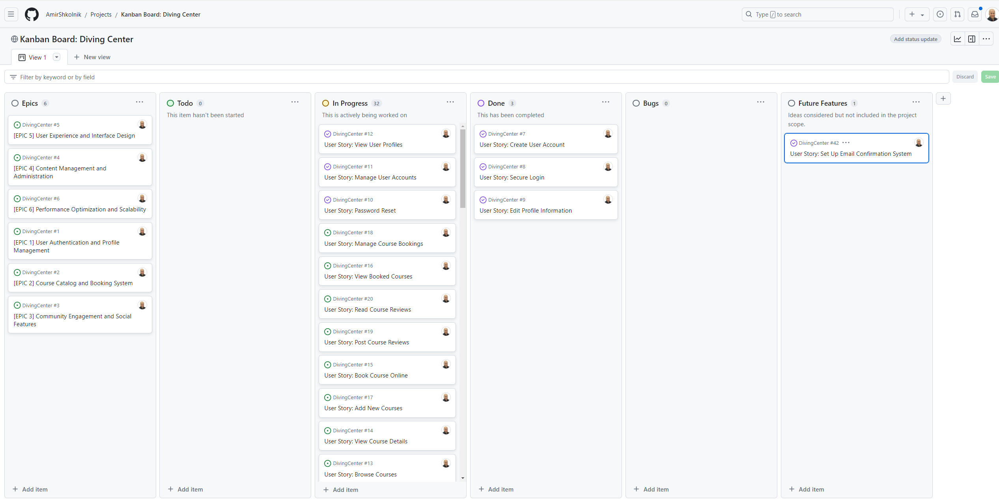

[Diving Center User Stories Link](https://github.com/AmirShkolnik/DivingCenter/issues)

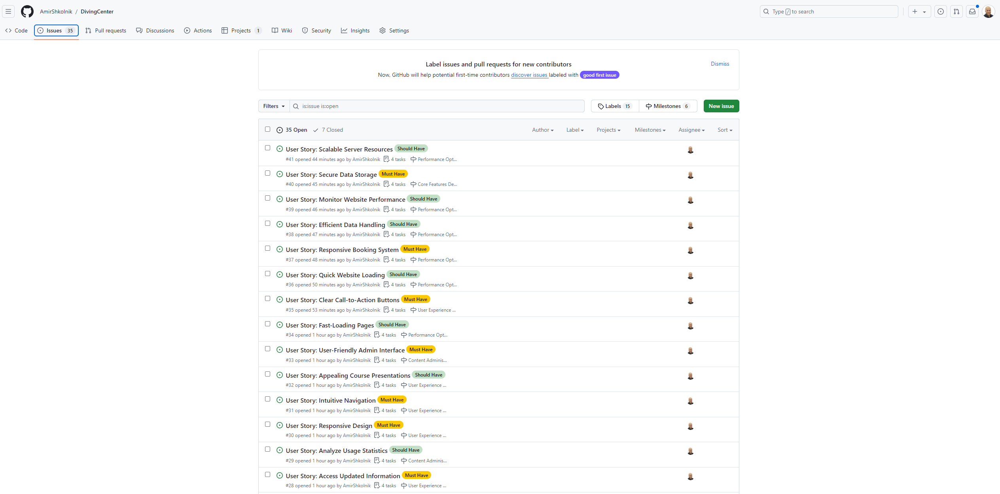

| Epic | Title | User Story | MoSCoW Priority | Milestone |
|------|-------|------------|-----------------|-----------|
| EPIC 1: User Authentication and Profile Management | Create User Account | As a user, I want to create an account so that I can access personalized features of the diving center website. | Must Have | Core Features Development |
| EPIC 1: User Authentication and Profile Management | Secure Login | As a user, I want to log in to my account securely so that I can access my personal information and bookings. | Must Have | Core Features Development |
| EPIC 1: User Authentication and Profile Management | Edit Profile Information | As a user, I want to edit my profile information so that I can keep my details up to date. | Should Have | User Experience Enhancements |
| EPIC 1: User Authentication and Profile Management | Password Reset | As a user, I want to reset my password if I forget it so that I can regain access to my account. | Must Have | Core Features Development |
| EPIC 1: User Authentication and Profile Management | Manage User Accounts | As an admin, I want to manage user accounts so that I can assist users with account-related issues. | Must Have | Content Administration |
| EPIC 1: User Authentication and Profile Management | View User Profiles | As an admin, I want to view user profiles so that I can understand our user base better. | Should Have | Content Administration |
| EPIC 2: Course Catalog and Booking System | Browse Courses | As a user, I want to browse available diving courses so that I can find courses that interest me. | Must Have | Core Features Development |
| EPIC 2: Course Catalog and Booking System | View Course Details | As a user, I want to view detailed information about each course so that I can make informed decisions. | Must Have | Core Features Development |
| EPIC 2: Course Catalog and Booking System | Book Course Online | As a user, I want to book a course online so that I can secure my spot conveniently. | Must Have | Core Features Development |
| EPIC 2: Course Catalog and Booking System | View Booked Courses | As a user, I want to view my booked courses so that I can keep track of my upcoming diving activities. | Should Have | User Experience Enhancements |
| EPIC 2: Course Catalog and Booking System | Add New Courses | As an admin, I want to add new courses to the catalog so that I can keep our offerings up to date. | Must Have | Content Administration |
| EPIC 2: Course Catalog and Booking System | Manage Course Bookings | As an admin, I want to manage course bookings so that I can ensure proper allocation of resources. | Must Have | Content Administration |
| EPIC 3: Community Engagement and Social Features | Post Course Reviews | As a user, I want to post reviews for courses I've taken so that I can share my experiences with others. | Should Have | Community Engagement |
| EPIC 3: Community Engagement and Social Features | Read Course Reviews | As a user, I want to read reviews from other divers so that I can make informed decisions about courses. | Should Have | Community Engagement |
| EPIC 3: Community Engagement and Social Features | Participate in Forums | As a user, I want to participate in discussion forums so that I can engage with other diving enthusiasts. | Could Have | Community Engagement |
| EPIC 3: Community Engagement and Social Features | Share Diving Experiences | As a user, I want to share my diving experiences through a personal feed so that I can connect with other divers. | Could Have | Community Engagement |
| EPIC 3: Community Engagement and Social Features | Moderate User Content | As an admin, I want to moderate user-generated content so that I can maintain a positive community environment. | Must Have | Content Administration |
| EPIC 3: Community Engagement and Social Features | Manage Community Events | As an admin, I want to create and manage community events so that I can foster user engagement. | Should Have | Community Engagement |
| EPIC 4: Content Management and Administration | Update Course Information | As an admin, I want to update course information easily so that I can keep the course catalog current. | Must Have | Content Administration |
| EPIC 4: Content Management and Administration | Manage Static Content | As an admin, I want to manage static page content so that I can keep information accurate and up-to-date. | Must Have | Content Administration |
| EPIC 4: Content Management and Administration | Publish Blog Posts | As an admin, I want to create and publish blog posts so that I can share diving-related news and tips. | Should Have | Content Administration |
| EPIC 4: Content Management and Administration | Access Updated Information | As a user, I want to access up-to-date information about diving courses and center policies so that I can stay informed. | Must Have | User Experience Enhancements |
| EPIC 4: Content Management and Administration | Analyze Usage Statistics | As an admin, I want to analyze website usage statistics so that I can make data-driven decisions about content and features. | Should Have | Content Administration |
| EPIC 5: User Experience and Interface Design | Responsive Design | As a user, I want a responsive design so that I can access the website comfortably on any device. | Must Have | User Experience Enhancements |
| EPIC 5: User Experience and Interface Design | Intuitive Navigation | As a user, I want intuitive navigation so that I can easily find the information I'm looking for. | Must Have | User Experience Enhancements |
| EPIC 5: User Experience and Interface Design | Appealing Course Presentations | As a user, I want visually appealing course presentations so that I can quickly understand what each course offers. | Should Have | User Experience Enhancements |
| EPIC 5: User Experience and Interface Design | User-Friendly Admin Interface | As an admin, I want a user-friendly admin interface so that I can efficiently manage website content and users. | Must Have | Content Administration |
| EPIC 5: User Experience and Interface Design | Fast-Loading Pages | As a user, I want fast-loading pages so that I can browse the website without frustration. | Should Have | Performance Optimization |
| EPIC 5: User Experience and Interface Design | Clear Call-to-Action Buttons | As a user, I want clear call-to-action buttons so that I can easily take next steps (e.g., booking a course). | Must Have | User Experience Enhancements |
| EPIC 6: Performance Optimization and Scalability | Quick Website Loading | As a user, I want the website to load quickly so that I can access information without delay. | Should Have | Performance Optimization |
| EPIC 6: Performance Optimization and Scalability | Responsive Booking System | As a user, I want the booking system to be responsive even during peak times so that I can secure my spot in popular courses. | Must Have | Performance Optimization |
| EPIC 6: Performance Optimization and Scalability | Efficient Data Handling | As an admin, I want the content management system to handle large amounts of data efficiently so that I can manage a growing course catalog. | Should Have | Performance Optimization |
| EPIC 6: Performance Optimization and Scalability | Monitor Website Performance | As an admin, I want to monitor website performance so that I can identify and address issues promptly. | Should Have | Performance Optimization |
| EPIC 6: Performance Optimization and Scalability | Secure Data Storage | As a user, I want my personal data to be securely stored and processed so that I can trust the platform with my information. | Must Have | Core Features Development |
| EPIC 6: Performance Optimization and Scalability | Scalable Server Resources | As an admin, I want the ability to scale server resources easily so that I can accommodate growing user numbers without service interruptions. | Should Have | Performance Optimization |
| EPIC 7: Advanced Platform Features and Integrations | Browse and Purchase Diving Equipment | As a user, I want to browse and purchase diving equipment through the platform so that I can easily acquire the gear I need for my diving activities. | Could Have | Advanced Features Integration |
| EPIC 7: Advanced Platform Features and Integrations | View Relevant Third-Party Advertisements | As a user, I want to view relevant third-party advertisements while browsing the platform so that I can discover new products or services related to diving. | Won't Have | Advanced Features Integration |
| EPIC 7: Advanced Platform Features and Integrations | View Relevant Third-Party Advertisements | As an admin and business owner I can add relevant third-party advertisements so that I can monitize my website. | Won't Have | Advanced Features Integration |
| EPIC 7: Advanced Platform Features and Integrations | Use Real-Time Underwater Communication Tools | As a diver, I want to use real-time underwater communication tools so that I can stay connected with my diving partners during underwater activities. | Won't Have | Advanced Features Integration |
| EPIC 7: Advanced Platform Features and Integrations | Book Dive Travel Packages | As a user, I want to book dive travel packages through the platform so that I can plan and organize my diving trips conveniently. | Won't Have | Advanced Features Integration |
| EPIC 7: Advanced Platform Features and Integrations | Access Personalized Diving Recommendations | As a user, I want to receive personalized recommendations for courses, equipment, and dive sites based on my preferences and experience level so that I can enhance my diving journey. | Won't Have | Advanced Features Integration |
| EPIC 7: Advanced Platform Features and Integrations | Maintain Interactive Dive Log | As a user, I want to maintain an interactive digital dive log so that I can record and share my diving experiences easily. | Won't Have | Advanced Features Integration |

This table provides a comprehensive overview of the user stories for the Diving Center website, organized by epics and prioritized using the MoSCoW method. The milestones are assigned based on the nature of each user story and its priority.

Click to explore the [Diving Center GitHub Link](https://github.com/AmirShkolnik/DivingCenter)

Click to exploer the [Diving Center API - DataBase](https://github.com/AmirShkolnik/pp5_api)

#### Milestones

**A milestone**, is a major checkpoint or goal in a project's timeline that signifies the completion of a key phase or the achievement of a significant objective.

##### Milestone 1: Core Platform and features Development
- Establishing the Foundation
  - This milestone focuses on implementing the essential features of the platform, including user authentication, course catalog, and basic community features. It lays the groundwork for a functional and secure website.

##### Milestone 2: Content Management System
- Empowering Efficient Management
  - This phase focuses on creating robust admin tools for managing user-generated content, courses, and overall site maintenance, ensuring the platform remains current and well-moderated.

##### Milestone 3: Community Engagement
- Fostering a Vibrant Diving Community
  - This milestone centers on developing and launching features that encourage user interaction and content creation, such as forums, review systems, and experience sharing functionalities.

##### Milestone 4: User Experience Enhancement
- Crafting an Intuitive Interface
    - This phase involves refining the user interface and experience, ensuring the platform is user-friendly, responsive, and accessible across various devices. It includes implementing personalized dashboards and easy navigation.

##### Milestone 5: Platform Optimization and Launch Preparation
- Enhancing Speed and Reliability
    - This milestone involves optimizing the website's performance, including improving load times, enhancing data handling, and ensuring the platform can handle increased user traffic efficiently.

##### Milestone 6: Advanced Features Integration
- Elevating the Platform Experience
    - This final phase introduces advanced features like personalized recommendations, interactive dive logs, and integration with external diving resources, further enriching the user experience and platform capabilities.

#### Epics

**An epic** is a large feature or goal that is divided into smaller tasks or user stories to be completed over multiple sprints.

##### EPIC 1: User Authentication and Profile Management
- **Goal:** Implement a secure and user-friendly authentication system and profile management features to enable personalized experiences for divers.
- **Associated User Stories:**
  - Create an account to access personalized features
  - Log in securely to access personal information and bookings
  - Edit profile information to keep details up to date
  - Reset password to regain account access
  - Manage user accounts to assist with account-related issues
  - View user profiles to understand the user base better

##### EPIC 2: Course Catalog and Booking System
- **Goal:** Develop a comprehensive course catalog with an efficient booking system to facilitate easy course discovery and registration for users.
- **Associated User Stories:**
  - Browse available diving courses to find interesting options
  - View detailed course information to make informed decisions
  - Book courses online to secure spots conveniently
  - View booked courses to track upcoming diving activities
  - Add new courses to the catalog to keep offerings up to date
  - Manage course bookings to ensure proper resource allocation

##### EPIC 3: Community Engagement and Social Features
- **Goal:** Create a vibrant online community for divers to connect, share experiences, and engage with each other.
- **Associated User Stories:**
  - Post reviews for completed courses to share experiences
  - Read reviews from other divers to make informed course decisions
  - Participate in discussion forums to engage with other diving enthusiasts
  - Share diving experiences through a personal feed to connect with other divers
  - Moderate user-generated content to maintain a positive community environment
  - Create and manage community events to foster user engagement

##### EPIC 4: Content Management and Administration
- **Goal:** Implement a robust content management system to allow easy updates and maintenance of the website's content.
- **Associated User Stories:**
  - Update course information easily to keep the catalog current
  - Manage static page content to maintain accurate information
  - Create and publish blog posts to share diving-related news and tips
  - Access up-to-date information about courses and center policies
  - Manage user-generated content to align with community guidelines
  - Analyze website usage statistics to make data-driven decisions

##### EPIC 5: User Experience and Interface Design
- **Goal:** Create an intuitive, responsive, and visually appealing interface that enhances user engagement and satisfaction.
- **Associated User Stories:**
  - Implement responsive design for comfortable access on any device
  - Provide intuitive navigation to easily find information
  - Create visually appealing course presentations for quick understanding
  - Develop a user-friendly admin interface for efficient management
  - Ensure fast-loading pages for frustration-free browsing
  - Include clear call-to-action buttons for easy next steps

##### EPIC 6: Performance Optimization and Scalability
- **Goal:** Ensure the website performs efficiently and can handle increasing user loads as the diving center grows.
- **Associated User Stories:**
  - Optimize website loading speed for quick information access
  - Ensure responsive booking system during peak times
  - Implement efficient content management system for large data handling
  - Monitor website performance to identify and address issues promptly
  - Secure personal data storage and processing for user trust
  - Enable easy scaling of server resources to accommodate growth

###### EPIC 7: Advanced Platform Features and Integrations

- **Goal:**
To enhance the Diving Center platform with advanced features and integrations that elevate the user experience, provide additional services, and create new revenue streams. These features, while not essential for the initial launch, will significantly expand the platform's capabilities and appeal to a broader range of diving enthusiasts.

- **Associated User Stories:**

- Browse and Purchase Diving Equipment (e-commerse)
- View Relevant Third-Party Advertisements
- Use Real-Time Underwater Communication Tools
-Book Dive Travel Packages
  
Every epic represents a major feature area, guiding development from initial setup to a full-fledged, engaging community platform

## Scope Plane

**Purpose:**

The Diving Center website aims to be a one-stop shop for all things scuba diving, catering to both experienced divers and those curious about getting started. Here's a breakdown of its purpose:

#### For Divers:

- Streamlined Course Booking: Simplifies finding and booking diving courses that suit your interests and experience level.

- Community Hub: Provides a platform to connect with fellow divers, share experiences, and learn from each other through reviews, discussions, and potentially even future social features.

- Informative Content: Offers valuable resources like course details, blog posts, and potentially an interactive dive log (future feature) to enhance your diving journey.

#### For the Diving Center:

- Enhanced User Engagement: Creates a user-friendly platform to attract new customers and retain existing ones through a seamless booking system and engaging features.

- Efficient Management: Provides an admin interface to manage courses, user accounts, website content, and potentially even analyze user data to optimize course offerings (future feature).

- Community Building: Fosters a community of divers around the diving center, potentially leading to increased brand loyalty and customer base.

Overall, the website's purpose is to create a mutually beneficial environment for both divers and the diving center by simplifying course booking, fostering a community, and providing valuable resources.

**Goals:**

- Establish a user-friendly platform for divers to explore and book diving courses.
- Enhance user experience through informative content and interactive features.
- Foster a community of diving enthusiasts for knowledge sharing and engagement.
- Streamline course management and user administration for efficient business operations.

**Target Audience:**

- Scuba divers of all experience levels
- Potential new divers interested in learning

**User Needs:**
- User Authentication and Profile Management: Securely create, manage, and access user accounts.
- Course Catalog and Booking System: Browse courses, view details, and book online conveniently.
- Community Engagement and Social Features: Share experiences, read reviews, and participate in discussions.
- Content Management and Administration: Easily manage website content, user accounts, and course information.
- User Experience and Interface Design: Enjoy a responsive, intuitive, and visually appealing website.
- Performance Optimization and Scalability: Experience fast loading times and a reliable booking system.
- Secure Data Storage: Trust that personal information is stored and processed securely.

**Features:**

- Seamless User Experience:
  - Create an account, log in securely, and manage your profile with ease.
  - Browse a user-friendly course catalog with detailed information.
  - Book courses directly through the website with a responsive booking system.
  - Navigate intuitively and access updated information effortlessly.
  - Experience fast loading pages for a smooth browsing experience.
- Streamlined Administration:
  - Manage user accounts and update course information efficiently through a user-friendly admin interface.
  - Manage static content on the website to ensure accurate and up-to-date information.
  - Monitor website performance to identify and address any issues promptly.

- Engaging Community Features:
  - Participate in discussions and share your diving experiences through community events (managed by admins).
  - Post and read course reviews to make informed decisions about your diving education.
  - Stay informed with the latest diving news and tips through blog posts published by admins.


## Structural Plane

**Information Architecture:**

1. Home Page
   - Welcome message and site introduction
   - Quick links to course catalog, community social page, and user registration/login

2. Course Catalog
   - List of available diving courses
   - Course categories (e.g., beginner, advanced, specialties)
   - Links to individual course pages

3. Individual Course Page
   - Course title, level, and duration
   - Detailed course description and requirements
   - Instructor information
   - User reviews and ratings
   - Course booking option

4. Community Hub
   - Discussion social page
   - Recent topics and popular threads
   - User-generated content (experiences, tips, photos)
   - Latest community posts and reviews

5. User Reviews
   - Can add review with rating system for courses
   - Can create, read, update and delete

7. User Profiles
   - Personal information and diving experience
   - Activity feed (recent reviews, forum posts, etc.)
   - Can see own booking
   - Can follow/unfollow other divers
   - Can create, read, update profile

8. Post Page
   - Can add posts
   - Can add images
   - Can create, read, update and delete


9. My Dashboard (for registered users)
   - Overview of booked courses
   - Can see feed
   - Can see list of liked posts

10. Contact Page
    - Contact form
    - Can create, read, update and delete

11. Booking Form
    - Can book diving course
    - Can create, read, update and delete

12. Registration and Login
    - User registration form
    - Login page
    - Password recovery option

13. Navigation
    - Primary Navigation: Home, Courses, Community, Dive Sites, Reviews
    - User Menu: My Dashboard, Profile, Messages, Settings (for logged-in users)
    - Secondary Navigation: About Us, Contact, FAQ
    - Footer: Terms of Service, Privacy Policy, Social Media Links

14. Search Functionality
    - Global search bar for posts in the feed

## Skeleton & Surface Planes

### Wireframes

**Desktop, Mobile and Tablet**

I've used [Balsamiq](https://balsamiq.com/wireframes) to design my site wireframes.

#### Home Page Wireframes
<details>
<summary>Click to View Home Page Wireframes</summary>

**Desktop, Mobile and Tablet**

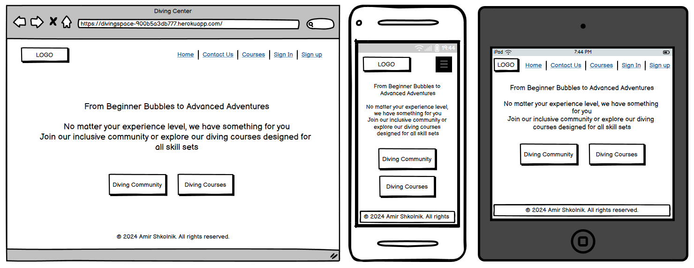

</details>

#### Contact Us Page Wireframes
<details>

<summary>Click to View Contact Us Page Wireframes</summary>

**Desktop, Mobile and Tablet**

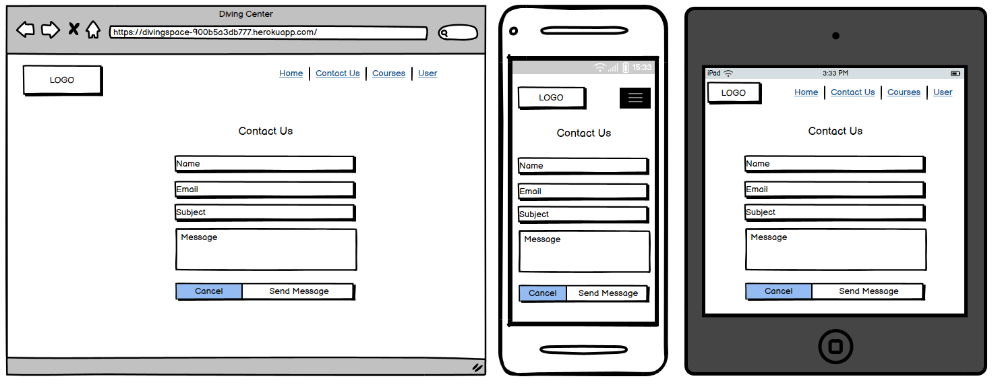

</details>

#### Courses Page Wireframes
<details>

<summary>Click to View Courses Page Wireframes</summary>

**Desktop, Mobile and Tablet**

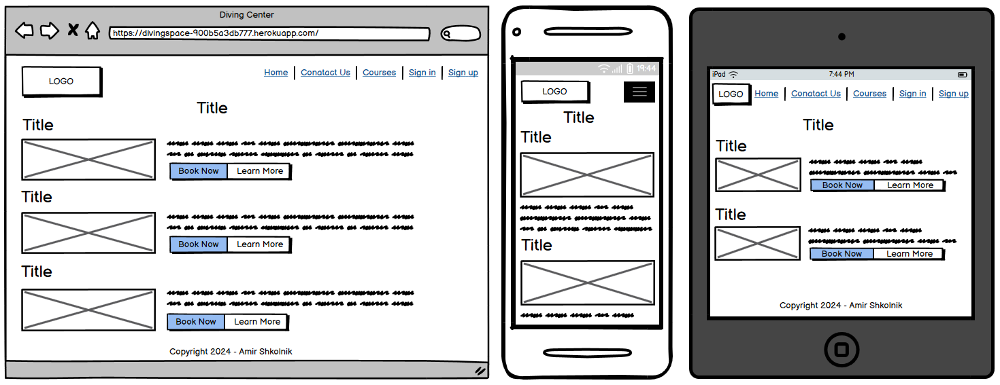

</details>

#### Single Course Page Wireframes
<details>

<summary>Click to View Single course Page Wireframes</summary>

**Desktop, Mobile and Tablet**

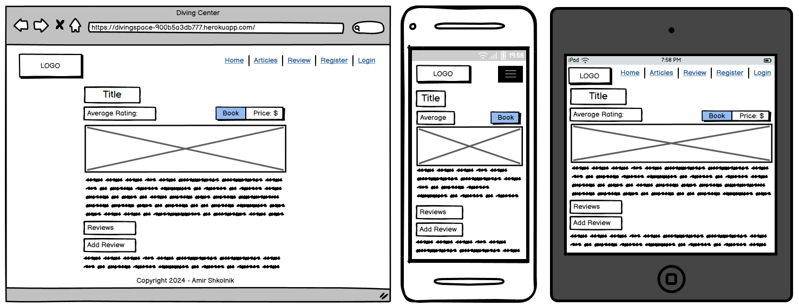

</details>

#### Booking Page Wireframes
<details>

<summary>Click to View Booking Page Wireframes</summary>

**Desktop, Mobile and Tablet**

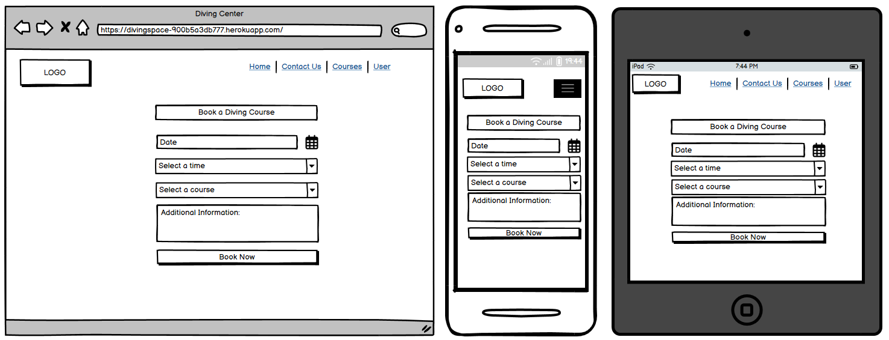

</details>

#### My Booking Page Wireframes
<details>

<summary>Click to View My Booking Page Wireframes</summary>

**Desktop, Mobile and Tablet**

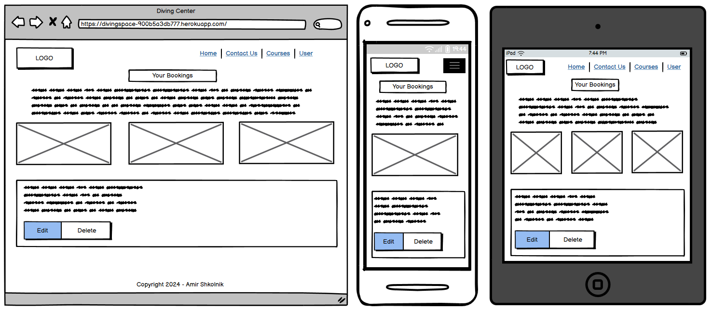

</details>

#### Sign Up Page Wireframes
<details>

<summary>Click to View Sign Up Page Wireframes</summary>

**Desktop, Mobile and Tablet**

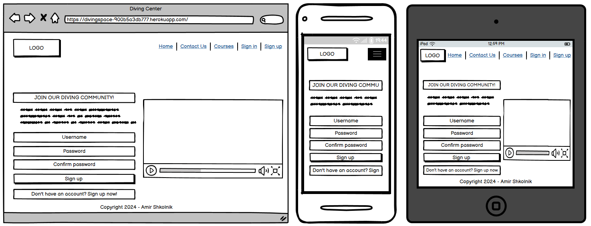

</details>

#### Sign In Page Wireframes
<details>

<summary>Click to View Sign In Page wireframes</summary>

**Desktop, Mobile and Tablet**

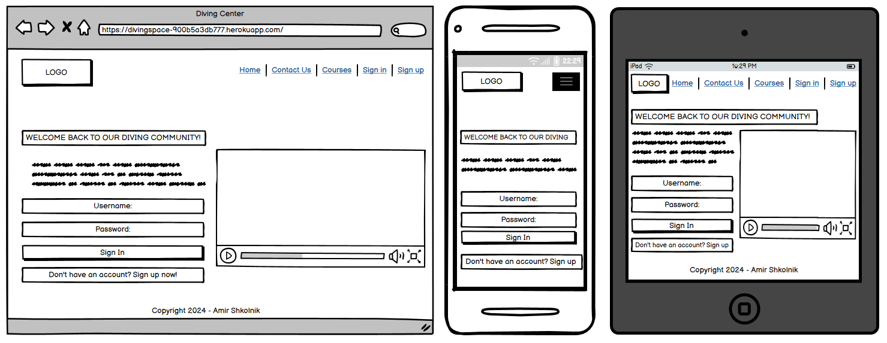

</details>

#### Add Post Wireframes
<details>

<summary>Click to View Add Post Wireframes</summary>

**Desktop, Mobile and Tablet**

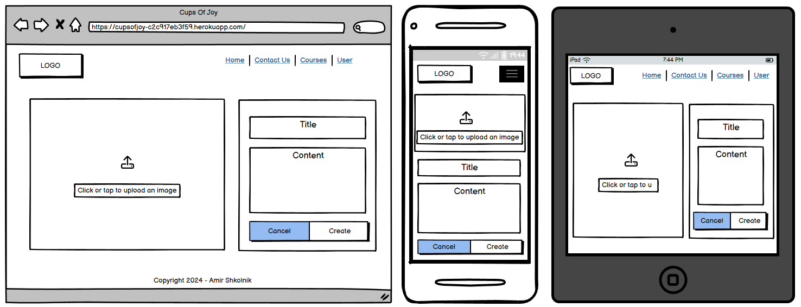

</details>

#### Post Page Wireframes
<details>

<summary>Click to View Post Page Wireframes</summary>

**Desktop, Mobile and Tablet**

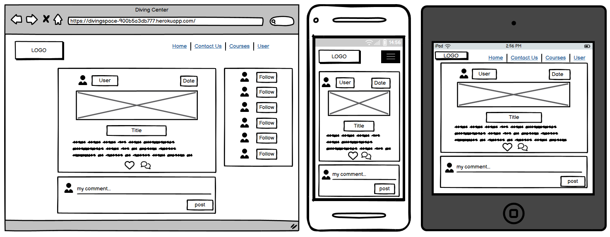

</details>

#### Feed Wireframes
<details>

<summary>Click to View Feed wireframes</summary>

**Desktop, Mobile and Tablet**

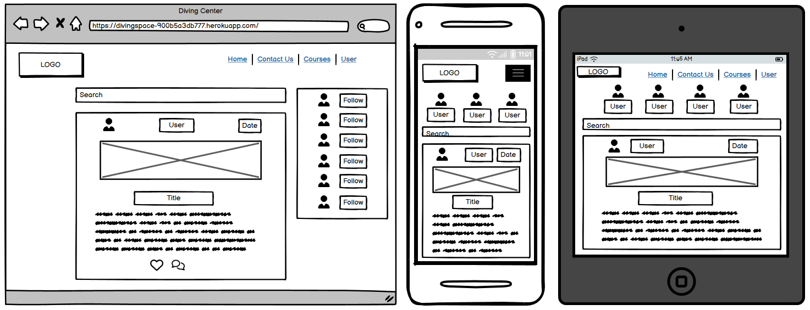

</details>

#### Liked Wireframes
<details>

<summary>Click to View Liked wireframes</summary>

**Desktop, Mobile and Tablet**

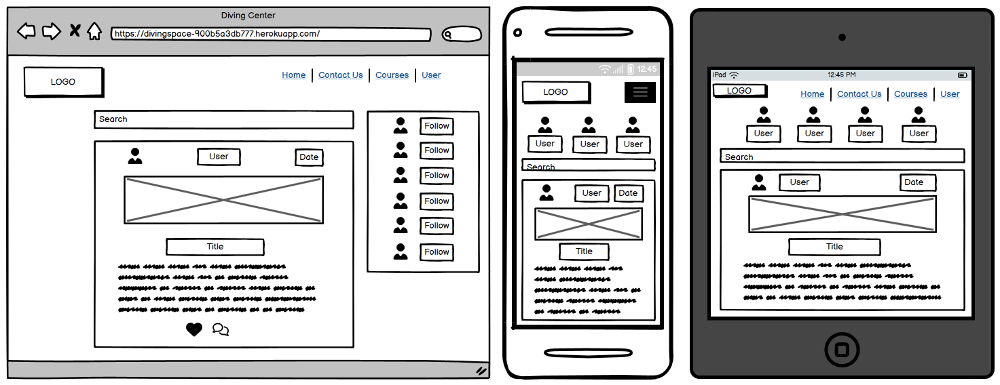

</details>

#### Profile Page Wireframes
<details>

<summary>Click to View Profile Page wireframes</summary>

**Desktop, Mobile and Tablet**

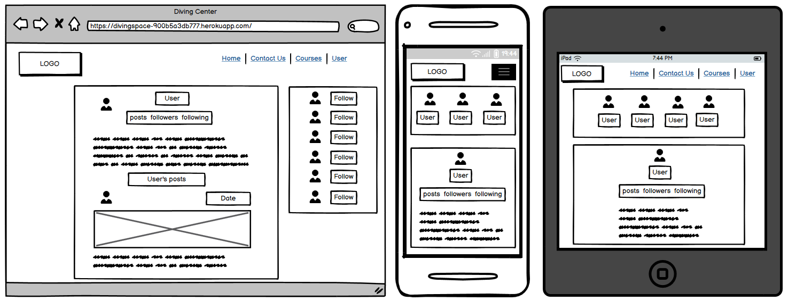

</details>

#### NavBar and Footer Wireframes
<details>

<summary>Click to View Add and Edit Review Page wireframes</summary>

**Desktop, Mobile and Tablet**

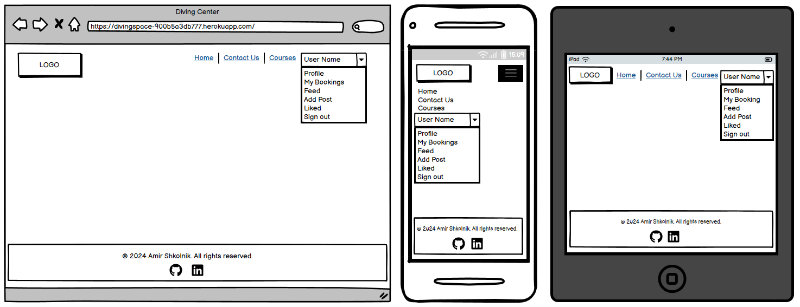

</details>

### Database Schema - Entity Relationship Diagram

I've used [dbdiagram](https://dbdiagram.io/home) to design my site's ERD.

#### Database Schema

#### Entity Relationship Diagram (ERD)


The Entity Relationship Diagram (ERD) is a visual representation of the database structure for the Diving Center project. It illustrates the relationships between different entities (tables) and their attributes (columns). The ERD helps in understanding the data organization and facilitates efficient database design.

#### Tables Overview

In the Diving Center project, the ERD consists of the following entities:

### Entities

1. **User**: This entity stores user information such as username, email, password, and other relevant details.

2. **Post**: This entity represents the posts or content created by users. It may include attributes like post title, content, date, and author (linked to the User entity).

3. **Like**: This entity tracks the likes given by users on posts. It may have attributes like the user who liked the post and the post that was liked.

4. **Favorite**: This entity stores the posts marked as favorites by users. It may have attributes like the user who favorited the post and the post that was favorited.

5. **Review**: This entity represents the reviews or ratings given by users for posts. It may include attributes like the review text, rating score, and the user who wrote the review.

6. **Comment**: This entity stores the comments made by users on posts. It may have attributes like the comment text, date, and the user who posted the comment.

7. **Contact**: This entity stores contact information submitted by users through a contact form. It may include attributes like name, email, message, and date.

#### Relationships

The relationships between these entities are as follows:

- **User** has a one-to-many relationship with **Post**, **Like**, **Favorite**, **Review**, and **Comment**, meaning a user can have multiple posts, likes, favorites, reviews, and comments.
- **Post** has a one-to-many relationship with **Like**, **Favorite**, **Review**, and **Comment**, meaning a post can have multiple likes, favorites, reviews, and comments.
- **Like** has a many-to-one relationship with **User** and **Post**, indicating that a like is associated with one user and one post.
- **Favorite** has a many-to-one relationship with **User** and **Post**, indicating that a favorite is associated with one user and one post.
- **Review** has a many-to-one relationship with **User** and **Post**, indicating that a review is associated with one user and one post.
- **Comment** has a many-to-one relationship with **User** and **Post**, indicating that a comment is associated with one user and one post.

The ERD provides a clear understanding of the data structure and relationships within the Diving Center project, facilitating efficient database design and development.

### Security

The "Diving Center" coffee project takes keeping your information safe very seriously. The developers have put in place strong protections to guard against bad people trying to access or misuse your data.

Only authorized users with the proper permissions can view or make changes to sensitive information within the application. The code that runs the app is also written in a secure way to prevent any vulnerabilities or weaknesses that could be exploited by hackers.

One such protection is against Cross-Site Request Forgery (CSRF) attacks. CSRF protection ensures that unauthorized commands are not executed on behalf of authenticated users without their knowledge. This safeguard prevents malicious sites from tricking users into performing unwanted actions, thereby keeping your data secure.

The team behind "Diving Center" understands how important it is to protect the privacy and personal details of all users. That's why they have made data security one of their top priorities throughout the development process.

#### CRUD functunalities

 Django has special tools that make sure only the right people can view add, change or delete information on a website. These tools work together to keep everything safe and secure. First, there are "class-based views" that handle the basic actions like viewing, editing, and deleting information. 

These views make it easy to write code for common tasks.
Next, Django has an "authentication system" that checks if a user is logged in or not. If they are not logged in, it won't let them do certain things like edit or delete information. 

This authentication system has special mixins called "LoginRequiredMixin" and "UserPassesTestMixin". These mixins work with the class-based views to make sure that only logged-in users can perform certain actions.

If a user tries to do something they are not allowed to do, like edit someone else's information, the mixins will stop them. Instead of letting them do the wrong thing, the mixins will redirect the user to the login page.

This way, Django's tools work together to keep the website secure and prevent people from doing things they shouldn't be doing. It's like having a security guard that only lets the right people through the door.

#### Authentication and Authorization

 The "Diving Center" coffee project makes it very simple for new users to create accounts and existing users to log in. This is possible thanks to a special tool called "Django Allauth." With "Django Allauth," signing up and logging in happens smoothly and without any problems. Users don't have to worry about complicated steps or confusing instructions. They can easily become part of the "Diving Center" community and start exploring all the fun features right away!

#### Data Validation and Sanitization

 Checking the information people type into forms is very important. It helps make sure the data is correct and safe. This way, no one can put in bad or harmful information by mistake or on purpose. Validating forms protects the project and keeps everything working properly.

#### Error Handling

 When something goes wrong with the website, special pages are shown. These pages help explain the problem in a friendly way. They use simple words and pictures to make it easy for everyone to understand what happened. This way, if there is an issue, users won't feel lost or confused. The special pages will guide them and let them know what's going on in a clear and helpful manner.

#### Environment Security

 Keeping important information safe is very important in this project. This includes things like database addresses, secret codes, and cloud storage links.

During the building phase, these details are kept in a special file called .env.py. This file is not shared with others to protect the information.

When the project is ready to be used by people, the important information is stored in a different way called configurable variables. This makes it harder for anyone to see or misuse the information. It also turns off a setting called debug mode, which makes the project even more secure.By taking these steps, the project makes sure that sensitive data is well-protected and cannot be easily accessed by anyone who should not have access to it.

#### CSRF Protection

 Keeping Bad People Out: The coffee website has a special way to stop bad people from doing bad things. It uses a secret code called a "CSRF token." This code is like a password that gets sent with every form you fill out on the website. This secret code helps keep the website safe from people trying to do bad things.

## Responsiveness

### Screens of All Sizes


The "Diving Center" website works well on different devices like phones, tablets, and computers. This was done by using special code called Bootstrap. Bootstrap helps make websites look good on any screen size without needing too much extra code.

Instead of writing many lines of code for different screen sizes, Bootstrap has a simple way to make the website adjust itself automatically. This means the website will look great whether you're using a small phone screen or a big computer monitor.

By using Bootstrap's smart design, the "Diving Center" website can be easily viewed and used on any device. This was an excellent chance to practice using Bootstrap and make the website work smoothly everywhere with just a little bit of code.

# Features

## Existing Features

### All Existing Features with Screenshots

Features descriptions, feedback messages and images

| Feature                          | Description                                                                                                                                                                                                                                                                                                                                                                                                                                                                                                                                                                                                                                                                                                                                                                                                                                                                                                                                                                                | Who            |
|----------------------------------|--------------------------------------------------------------------------------------------------------------------------------------------------------------------------------------------------------------------------------------------------------------------------------------------------------------------------------------------------------------------------------------------------------------------------------------------------------------------------------------------------------------------------------------------------------------------------------------------------------------------------------------------------------------------------------------------------------------------------------------------------------------------------------------------------------------------------------------------------------------------------------------------------------------------------------------------------------------------------------------------|----------------|
| Logo                             | The logo consists of an image of a white mug and the text "CUP of JOY" in a stylized font. The word "CUP" is in a bold blue color, the word "of" is in white, and the word "JOY" is in a thin blue font.<details> <summary>**Click to View The Logo**</summary> </details>                                                                                                                                                                                                                                                                                                                                                                                                                                                                                                                                                                                                                                                                                                                                                                                  |    Everyone            |
| Navigation Bar                   | The navigation bar includes links to the Home page, Articles page, and Reviews page, Register page and Login page The same links are available for smaller screen sizes with a hamburger menu. <details> <summary>**Click to View The Navigation Bar**</summary> </details> <details> <summary>**Click to View The Hamburger Menu**</summary> </details>                                                                                                                                                                                                                                                                                                                                                                                                                                                                                                                                                                                                                                                                                                                                  | Everyone       |
|                                  | Dropdown menu with links to "My Reviews", "Add New Review", "My Favourite Articles", "My Comments", and "Logout". <details> <summary>**Click to View The Navigation Bar**</summary> </details> <details> <summary>**Click to View The Drop Down Menu**</summary> </details> <details> <summary>**Click to View The Hamburger Drop Down Menu**</summary> </details>                                                                                                                                                                                                                                                                                                                                                                                                                                                                                                                                                                                                                                                                                                                                                                                                                                                                                                                                                                                                | Logged-in User |          
| Browse Articles Page             | The Browse Articles page allows users to access and view a collection of articles or blog posts focused on coffee-related topics. It serves as a central hub for users to explore and read various articles or content pieces within the website. <details> <summary>**Click to View The Articles Page**</summary> </details> <details> <summary>**Click to View The Articles Page- Navigation**</summary> </details>                                                                                                                                                                                                                                                                                                                                                                                                                                                                                                                                                                                                                                                                                                                                      | Everyone       |
| Browse Reviews Page              | The "Browse Reviews" page displays a list of approved coffee shop reviews submitted by users, with each review showing the title, excerpt, author, and publication date. If there are no reviews yet, it prompts the user to be the first to add a review or log in/register to add one. <details> <summary>**Click to View The Empty Reviews Page**</summary> </details> <details> <summary>**Click to View The Reviews Page**</summary> </details>                                                                                                                                                                                                                                                                                                                                                                                                                                                                                                                                                                                                                                                                                                   | Everyone       |
| Single Review Page               | This feature will allow users to view the details of a specific coffee shop review. When a user clicks on a review from the list of reviews (e.g., on the "Reviews" page or "My Reviews" page), they will be redirected to a dedicated page that displays the complete review information. <details> <summary>Click to View The Single Review Page</summary> </details>                                                                                                                                                                                                                                                                                                                                                                                                                                                                                                                                                                                                                                                                                                 | Everyone       |
|                                  | Registered users have the ability to create new reviews by accessing the "Add New Review" page and filling out a review form. Additionally, if a review belongs to the logged-in user, they have the option to edit and update the details of that review, as well as the ability to delete the review entirely. This level of control over user-generated content allows registered users to manage and maintain their reviews, fostering an interactive and personalized experience within the coffee shop review section of the website.<details> <summary>**Click to View The Single Review Page - Excerpt**</summary> </details>                                                                                                                                                                                                                                                                                                                                 | Logged-in User |
| Home Page                        | For visitors, the Cup Of Joy home page serves as an entry point to explore articles, coffee shop reviews, and information about the website. <details> <summary>**Click to View The Home Page - User**</summary> </details>                                                                                                                                                                                                                                                                                                                                                                                                                                                                                                                                                                                                                                                                                                                                                                                                                                               | Everyone       |
|                                  | For logged-in users, in addition to the visitor features, the home page provides access to personalized sections like managing their favorite articles, reviews, and comments through a user dropdown menu. <details> <summary>**Click to View The Home Page - Logged In User**</summary> </details>                                                                                                                                                                                                                                                                                                                                                                                                                                                                                                                                                                                                                                                                                                                                                                               | Logged-in User |
| Sign Up Page                     | The sign-up page welcomes new users to create an account on the website. It displays a form where users can enter their details and sign up, with options to cancel and return to the home page or sign in if they already have an account. <details> <summary>**Click to View The Sign Up Page**</summary> </details> <details> <summary>**Click to View The Sign Up Message**</summary> </details>                                                                                                                                                                                                                                                                                                                                                                                                                                                                                                                                                                                                                                                                                                                                               | Everyone       |
| Log In Page                      | The sign in/log in page welcomes back existing users to the blog and prompts them to enter their credentials to leave comments or like posts. If users haven't created an account yet, they are provided with a link to register first. <details> <summary>**Click to View The Log In Page**</summary> </details> <details> <summary>**Click to View The Log In Page - Message**</summary> </details>                                                                                                                                                                                                                                                                                                                                                                                                                                                                                                                                                                                                                                                                                                                                                   | Everyone       |
| Log Out Page                     | The sign out / log out page displays a confirmation message asking the user if they want to sign out. It provides a "Sign Out" button to confirm the action and a "Cancel" button to return to the home page. <details> <summary>**Click to View The Log Out Page**</summary> </details> <details> <summary>**Click to View The Log Out Message**</summary> </details>                                                                                                                                                                                                                                                                                                                                                                                                                                                                                                                                                                                                                                                                                                                                                                              | Logged-in User |
| About Page                       | The about page provides information about the "Cup Of Joy" website and includes a contact form. It displays a profile image and a brief introduction explaining that the website is dedicated to celebrating coffee culture, flavors, and experiences. The page encourages visitors to connect with the team and share their thoughts, suggestions, and experiences related to coffee. It includes a contact form where users can submit their inquiries or messages. <details> <summary>**Click to View The About Page**</summary> </details> <details> <summary>**Click to View The Contact Us - Message**</summary> </details>                                                                                                                                                                                                                                                                                                                                                                                                                                                                                                                   | Everyone       |
| Single Article Page                         | A visitor can view the article details but cannot interact with the content. A user can read the article, see the number of likes, and view comments, but will not see options to like, comment, or add the article to favorites. <details> <summary>**Click to View The Single Article Page - User**</summary> </details>                                                                                                                                                                                                                                                                                                                                                                                                                                                                                                                                                                                   | Everyone       |
|              | A logged-in user can view the article details and interact with the content. They will see options to like the article, leave a comment, and add the article to their favorites list. Appropriate feedback messages will be displayed based on their actions, such as "Article added to favorites" or "Comment submitted successfully." <details> <summary>**Click to View The Single Article Page - User Logged In** </summary> </details>                                                                                                                                                                                                                                                                                                                                                                                                                                                                                                                                                                                                                                                     | Logged-in User |
| Comments                         | The "My Comments" page displays a list of all the comments made by the logged-in user on different posts. If the user hasn't made any comments yet, a message indicating that is shown. While the "My Comments" page does not directly allow users to like, comment, or add posts to favorites, it serves as a central location for users to view and manage their existing comments. The ability to edit or delete comments is provided on the post detail page, which can be accessed by clicking on the post title from the "My Comments" page. When the user makes a comment on a post, it will be added to the "My Comments" page, providing feedback that their comment has been successfully submitted. If the user edits or deletes a comment from the post detail page, the changes will be reflected on the "My Comments" page, providing feedback that their action was successful. The user will be able to see the comment status for exp. waiting for approval or published. <details> <summary>**Click to View My Comments Page**</summary> </details> <details> <summary>**Click to View Comments**</summary> </details> <details> <summary>**Click to View delete Comment**</summary> </details> <details> <summary>**Click to View Delete Comment - Message**</summary> </details> | Logged-in User |
| Footer                           | The footer provides links to the Home page, Reviews page, About page, and social media links (Facebook, YouTube, and the developer's GitHub profile). <details> <summary>**Click to View The Footer - Home Page**</summary> </details> <details> <summary>**Click to View The Footer**</summary> </details> <details> <summary>**Click to View The Footer - Mobile**</summary> </details>                                                                                                                                                                                                                                                                                                                                                                                                                                                                                                                                                                                                                                                                                                                                                                                                                                                                                                                                                                                                                                                                                                                                                               | Everyone       |
| Like an Article  | All user can see the numbers of like but only logged-in user can like an article. <details> <summary>**Click to View The Add a Like Message**</summary> </details> <details> <summary>**Click to View The Like**</summary> </details>                                                                                                                                                                                                                                                                               
| Like Removal Confirmation Page   | The like removal page allows a logged-in user to confirm the removal of a liked post from their list of liked posts. User feedback is provided through success or error messages upon confirming or canceling the like removal action. The like removal page is not accessible to visitors as they cannot like or remove likes from posts. <details> <summary>**Click to View The Like Removal Page**</summary> </details> <details> <summary>**Click to View The Like Removal Message**</summary> </details>                                                                                                                                                                                                                                                                                                                                                                       | Logged-in User |
| My Favourites Page                  | A user trying to access the favourites page will be redirected to the sign-in page. This ensures that only authenticated users can view and manage their favorite posts. A logged-in user can access the favourites page, which displays a list of their saved favorite posts. If a logged-in user removes a favorite post, they will be redirected to a confirmation page to confirm the removal of that post from their favorites list, providing user feedback for the action. <details> <summary>**Click to View Add Favorite Message**</summary> </details> <details> <summary>**Click to View The Favourites Page**</summary> </details>                                                                                                                                                                                                                                                                                                                                                                                                                                                                                                               | Logged-in User |
| Favorite Removal Confirmation Page   | The favorite removal confirmation page displays the title of the post the user wants to remove from their favorites. It provides a "Confirm" button to proceed with the removal and a "Cancel" button that redirects the user back to the post detail page. This design ensures user feedback by requiring confirmation before removing a favorite, allowing the user to reconsider their decision. A user trying to access the favorites page will be redirected to the sign-in page. <details> <summary>**Click to View The Favorite Removal Confirmation Page**</summary> </details> <details> <summary>**Click to View The Favorite Removal Message**</summary> </details>                                                                                                                                                                                                                                                                                                                                                                                                                                                                                                          | Logged-in User |
| Add a Review                     | A logged-in user can add a new coffee shop review by filling out a form with details such as an image, headline, excerpt, and choosing between draft or publish status. The review is then submitted for approval by the admin through the Django dashboard. For a non-logged-in user, they will be redirected to the sign-in page when attempting to access the "Add New Review" page, as authentication is required to create a new review. When a logged-in user successfully submits a review for approval, a success message can be displayed, such as "Your review has been submitted for approval." If a logged-in user attempts to navigate away from the "Add New Review" page without submitting, a confirmation dialog display, asking if they want to discard their changes. <details> <summary>**Click to View The Add a Review Page**</summary> </details> <details> <summary>**Click to View The Add a Review Message**</summary> </details>                                                                                                                                                                                                   | Logged-in User |
| Review Removal Confirmation Page | For a logged-in user, the Review Removal Confirmation Page allows them to confirm the deletion of their own review before it is permanently removed. For a non-logged-in user, they will be redirected to the sign-in page since they cannot delete reviews they did not create. <details> <summary>**Click to View The Delete a Review Page**</summary> </details> <details> <summary>**Click to View The Delete a Review Message**</summary> </details>                                                                                                                                                                                                                                                                                                                                                                                                                                                                                                                                                                                                                                                                                                           | Logged-in User |
| Edit a Review                    | Logged-in users who are the authors of a review can edit and update their existing reviews. Only the author of a review or a superuser can access and modify the review details through this page. <details> <summary>**Click to View The Edit a Review Page**</summary> </details> <details> <summary>**Click to View The Edit a Review Message**</summary> </details>                                                                                                                                                                                                                                                                                                                                                                                                                                                                                                                                                                                                                                                                                                                                                        | Logged-in User |
| Error - 404 Page                         | The 404 error page is displayed when the requested URL or page cannot be found on the server. It provides a user-friendly message indicating that the requested resource is unavailable, along with a button to return to the homepage. <details> <summary>**Click to View The 404 Page**</summary> </details>                                                                                                                                                                                                                                                                                                                                                                                                                                                                                                                                                                                                                                                                                                                                                    | Everyone       |
| Error - 403 Page                         | The 403 error page is shown when the user does not have permission to access the requested resource. It informs the user that access to the requested page is forbidden, likely due to insufficient permissions or authentication issues. A button is provided to return to the homepage.                                                                                                                                                                                                                                                                                                                                                                                                                                                                                                                                                                                                                                                   | Everyone       |
| Error - 500 Page                         | The 500 error page is displayed when an internal server error occurs, indicating that the server encountered an unexpected condition that prevented it from fulfilling the request. It provides a user-friendly message stating that the requested page cannot be found, along with a button to return to the homepage.                                                                                                                                                                                                                                                                                                                                                                                                                                                                                                                                                                                    | Everyone       |
| Admin Panel                        | The Django admin panel allows administrators to manage the application's data through a user-friendly interface. <details> <summary>**Click to View The Admin Panel**</summary> </details>                                                                                                                                                                                                                                                                                                                                                                                                                                                                                                                                                                                    | Admin       |
---

### CRUD Functionality

The table below describes the CRUD operations that can be performed on Diving Center main features by a registered, logged-in user and admin.

| Feature               | Create                    | Read                        | Update               | Delete                 |
|-----------------------|---------------------------|-----------------------------|----------------------|------------------------|
| **User Account**     | Sign up for a new account | View own content | Edit own content     | Deactivate/Delete account |
| **Reviews**             | Publish new reviews        | Browse and read all articles and reviews  | Edit own reviews       | Remove own reviews       |
| **Comments**          | Comment on articles          | View comments              | Edit own comments    | Delete own comments    |
| **Likes**             | Like articles   | View likes on articles | Like/Unlike - Update amount                    | Unlike articles  |
| **Favourites**         | Add a favourite            | View favourites articles      |       Add/Remove - change color              | Remove own favourites       |
| **Articles**     | Add an article                         | View articles        | Edit own articles                    | Delete own articles                     |

## Future Features

Here are some future feature suggestions for the "Diving Center" project:

### About Us Page / Section
   - Information about the Diving Center platform
   - Mission statement and community guidelines
   - Team and instructor profiles

### Discussion forums
### Community events calendar

### Dive Site Directory
  - List of dive sites with brief descriptions
  - Map integration for location visualization
  - User reviews and ratings for each site
  - Option to save favorite dive sites (for registered users)

### My Dashboard (for registered users)
  - Personal diving log
  - Progress tracking for ongoing courses
  - Notifications and messages

### User Reviews
  - Option to sort and filter reviews
  - Links to full review pages

### FAQ section
  - Support resources

### Search Functionality
  - Global search bar for courses, dive sites, and community content
  - Advanced search options with filters

### Virtual Dive Tour Integration
- **Description:** Implement virtual reality (VR) or augmented reality (AR) tours of popular dive sites.
- **Benefit:** Allows users to preview dive locations before booking, enhancing decision-making and excitement for upcoming dives.

### AI-Powered Dive Buddy Matching
- **Description:** Develop an AI system that matches divers based on experience level, interests, and availability.
- **Benefit:** Facilitates connections between divers, enhancing safety and social aspects of diving experiences.

### Interactive Dive Log with Environmental Data
- **Description:** Create an advanced digital dive log that incorporates real-time environmental data such as water temperature, visibility, and marine life sightings.
- **Benefit:** Provides divers with a comprehensive record of their dives and contributes to citizen science efforts in marine conservation.

### Gear Maintenance Tracker
- **Description:** Implement a feature that helps divers track the maintenance schedule of their equipment.
- **Benefit:** Improves safety by ensuring gear is properly maintained and reminds users when servicing is due.

### Dive Site Conditions Forecasting
- **Description:** Integrate weather and ocean condition forecasting specifically tailored for dive sites.
- **Benefit:** Helps divers plan their trips more effectively and enhances safety by providing up-to-date environmental information.

### Underwater Photography Workshop and Gallery
- **Description:** Offer online workshops for underwater photography and create a platform for users to showcase their best shots.
- **Benefit:** Enhances skills of diving enthusiasts and provides a space for creative expression within the community.

### Eco-Friendly Dive Challenge
- **Description:** Create a gamified system that rewards divers for eco-friendly practices such as participating in underwater cleanups or using reef-safe sunscreen.
- **Benefit:** Promotes environmental consciousness among divers and contributes to marine conservation efforts.

# Technology Used

## Frontend

- [**HTML5**](https://developer.mozilla.org/en-US/docs/Web/Guide/HTML/HTML5): The latest version of the Hypertext Markup Language, used to structure and define the content of web pages. It introduced new elements and capabilities to enhance the language, improving accessibility, multimedia integration, and offline capabilities.
- [**CSS3**](https://developer.mozilla.org/en-US/docs/Web/CSS): The latest evolution of Cascading Style Sheets, a stylesheet language used to describe the presentation and styling of web content, including layout, colors, fonts, and animations. It provides more advanced styling features and better browser support compared to previous versions.
- [**JavaScript**](https://developer.mozilla.org/en-US/docs/Web/JavaScript): A high-level, dynamic programming language used to add interactivity, effects, and behaviors to web pages. It allows developers to manipulate web page content, respond to user events, and make asynchronous requests to servers.
- [**Bootstrap**](https://getbootstrap.com/): A popular open-source front-end framework for building responsive, mobile-first websites and web applications. It provides a collection of HTML, CSS, and JavaScript components and utilities for creating consistent and visually appealing user interfaces across different devices and screen sizes.

## Backend
- [**Django**](https://www.djangoproject.com/): A high-level Python web framework that follows the Model-View-Template architectural pattern. It promotes rapid development and clean, pragmatic design by providing built-in features for handling common web development tasks, such as URL routing, database integration, and user authentication.
- [**Python**](https://www.python.org/): A versatile, high-level programming language known for its simplicity, readability, and extensive standard library. It is widely used for backend development, data analysis, machine learning, and automation tasks.
- **CI database**: The database systems provided by Code Institute for storing and managing application data during the development and deployment process.

## Deployment and Version Control
- [**Git**](https://git-scm.com/): A distributed version control system that tracks changes in source code files and facilitates collaboration among multiple developers. It allows developers to manage and merge code changes efficiently, revert to previous versions, and maintain a detailed history of modifications.
- [**GitHub**](https://github.com/): A web-based hosting service for Git repositories, providing a platform for version control, collaboration, and code sharing. It offers features like issue tracking, pull requests, and project management tools to streamline the development workflow.
- [**Heroku**](https://www.heroku.com/): A cloud platform that enables developers to build, run, and operate applications entirely in the cloud. It supports various programming languages and provides a seamless deployment process, automatic scaling, and management tools for monitoring and maintaining applications.

## Development Tools
- [**GitPod**](https://www.gitpod.io/): A cloud-based integrated development environment (IDE) that allows developers to write, edit, and run code directly from their web browser. It provides a preconfigured development environment with all the necessary tools and dependencies installed, enabling a consistent and efficient coding experience across different projects and teams.
- [**Django Extensions**](https://github.com/django-extensions/django-extensions): A collection of custom management extensions for the Django web framework. It provides additional commands and utilities to enhance the development workflow, such as generating model diagrams, executing raw SQL queries, and generating fixtures for testing purposes.

## Libraries and Frameworks

Here are short descriptions for the libraries and frameworks used, following the provided formula:

- **asgiref**: A Python package that provides a sync and async-compatible ASGI (Asynchronous Server Gateway Interface) specification implementation.

- **black**: A Python code formatter that enforces a consistent code style by parsing Python syntax and re-printing it with a standard set of rules.

- **click**: A Python package for creating command-line interfaces with options, arguments, and commands.

- **cloudinary**: A cloud-based service that provides an end-to-end image and video management solution for websites and mobile applications.

- **crispy-bootstrap5**: A Django extension that provides a way to easily render Django forms using Bootstrap 5 styles.

- **dj-database-url**: A Django utility that allows you to parse database connection URLs.

- **dj3-cloudinary-storage**: A Django package that facilitates the integration of Cloudinary with Django's file storage system.

- **Django**: A high-level Python web framework that follows the Model-View-Template architectural pattern.

- **django-allauth**: A set of Django applications that handle account authentication, registration, and third-party account integration.

- **django-crispy-forms**: A Django application that provides a way to easily render Django forms using various CSS frameworks.

- **django-js-asset**: A Django application that allows you to include JavaScript files in your templates using Django's static file handling.

- **django-resized**: A Django application that provides a template tag for rendering resized versions of images.

- **django-summernote**: A Django application that integrates the Summernote WYSIWYG editor into Django's admin interface.

- **django-widget-tweaks**: A Django application that provides a set of template tags and filters for tweaking form field rendering.

- **gunicorn**: A Python WSGI HTTP server for running Python web applications.

- **oauthlib**: A Python library that provides a way to interact with various OAuth service providers.

- **pathspec**: A Python library for pattern matching of file paths.

- **pillow**: A Python Imaging Library (PIL) fork that adds support for opening, manipulating, and saving many different image file formats.

- **psycopg2**: A Python package that provides a database adapter for the PostgreSQL database server.

- **PyJWT**: A Python library for encoding and decoding JSON Web Tokens (JWT).

- **python3-openid**: A Python library that provides support for the OpenID decentralized authentication protocol.

- **requests-oauthlib**: A Python library that provides an easy-to-use implementation of the OAuth request-signing logic.

- **sqlparse**: A Python library that provides non-validating SQL parser for Python.

- **urllib3**: A Python library that provides a user-friendly HTTP client.

- **whitenoise**: A Python package that provides a way to serve static files from a Django application.

Citations and sources:

[1] https://developer.mozilla.org/en-US/docs/Web/CSS

[2] https://developer.mozilla.org/en-US/docs/Web/JavaScript

[3] https://developer.mozilla.org/en-US/docs/Web/Guide/HTML/HTML5

[4] https://www.slideshare.net/slideshow/coffee-shop-management-systempptx/255161865

[5] https://www.beliveweb.com/coffee-shop-website-design.html


## Validation Tools

- [**W3C Markup Validation Service**](https://validator.w3.org/): This is a free tool provided by W3C that checks the syntax of web documents written in markup languages like HTML, XHTML, SMIL, and MathML against their respective specifications. It helps identify any discrepancies or errors in the markup code, ensuring compliance with web standards.
- [**W3C CSS Validation Service**](https://jigsaw.w3.org/css-validator/): A tool offered by W3C that validates Cascading Style Sheets (CSS) code against the official CSS specifications. It checks for syntax errors, property value validity, and other potential issues in CSS stylesheets, helping developers ensure their styles are correctly implemented.
- [**JSHint**](https://jshint.com/): A community-driven tool that detects errors and potential problems in JavaScript code. It performs static code analysis and provides feedback on coding conventions, syntax errors, and other issues that may lead to bugs or performance problems. JSHint helps maintain code quality and consistency across projects.
- [**CI Python Linter**](https://pep8ci.herokuapp.com/): A code linting tool used in the Code Institute's development environment to analyze Python code for potential errors, stylistic inconsistencies, and adherence to best practices defined by the Python Enhancement Proposals (PEPs). It helps catch issues early in the development process and promotes code quality and maintainability.
- [**Google Lighthouse**](https://developers.google.com/web/tools/lighthouse): An open-source automated tool developed by Google that audits web pages for performance, accessibility, progressive web app capabilities, and other best practices. It provides a comprehensive report with scores and recommendations to help developers optimize their websites and improve the overall user experience.

Citations and sources:

[1] https://developer.mozilla.org/en-US/docs/Web/CSS

[2] https://developer.mozilla.org/en-US/docs/Web/JavaScript

[3] https://validator.w3.org/docs/help

[4] https://validator.w3.org

## Others
- [**Cloudinary**](https://cloudinary.com/): An end-to-end image and video management solution.
- [**Favicon.io**](https://favicon.io/): To generate favicon icons for the website.
- [**Font Awesome**](https://fontawesome.com/): Provides icons for enhancing UI/UX.
- [**Tiny Png**](https://tinypng.com/): To compress the images.
- [**Free Convert**](https://www.freeconvert.com/): To convert PNG, JPG, JPEG...images to Webp format.

# Testing

For all testing and validation, please refer to the [TESTING.md](TESTING.md) file.

# Deployment

The "Diving Center" project leverages a combination of platforms and services to facilitate its deployment and management.

For hosting and running the application, Heroku, a cloud platform as a service (PaaS), is utilized. It enables seamless deployment, automatic scaling, and management tools for monitoring and maintaining the application. The Code Institute (CI) database systems are employed to store and manage the application's data during development and deployment phases.

Additionally, Cloudinary, a cloud-based service, is integrated to handle image and video management, providing an end-to-end solution for storing, optimizing, and delivering media assets for the "Diving Center" platform.
The respective URLs for these platforms and services are as follows:

## GitHub
- **Repository Setup:** GitHub serves as the version control system, hosting the project's codebase and enabling collaboration among developers.
[GitHub](https://github.com)

## Gitpod
- **Development Environment:** Gitpod, a cloud-based integrated development environment (IDE), provides a streamlined coding experience by offering a preconfigured workspace with all the necessary tools and dependencies. [Gitpod](https://www.gitpod.io/)

## Heroku
- **Application Hosting:** For hosting and running the application, Heroku, a cloud platform as a service (PaaS), is utilized. It enables seamless deployment, automatic scaling, and management tools for monitoring and maintaining the application.
[Heroku](https://www.heroku.com)
  - **Setting up on Heroku:**
Here's a simplified 10-step explanation on how to use Heroku's cloud server to deploy your "Diving Center" coffee project, written in easy-to-understand language for non-coders:

1. **Sign up for Heroku**: Go to heroku.com and create an account.

2. **Create a new app**: After logging in, click on the "New" button in the top right corner and select "Create New App". Give your app a unique name and choose your preferred region.

3. **Connect to GitHub**: In the "Deploy" section, select "GitHub" as the deployment method. Search for your "Diving Center" repository and connect it to Heroku.

4. **Set up environment variables**: In the "Settings" section, click on "Reveal Config Vars". Here, you'll need to add some important variables:
   - `SECRET_KEY`: A secret key for your Django project (you can generate one online).
   - `DATABASE_URL`: The URL for your database (e.g., Heroku Postgres).
   - `CLOUDINARY_URL`: The URL for your Cloudinary account (for storing images and media).

5. **Enable automatic deploys**: In the "Deploy" section, you can choose to enable automatic deploys from your GitHub repository. This means Heroku will automatically update your app whenever you push new changes to GitHub.

6. **Deploy your app**: If you didn't enable automatic deploys, you can manually deploy your app by scrolling down to the "Manual Deploy" section and clicking "Deploy Branch".

7. **Open your app**: After a successful deployment, Heroku will provide you with a unique URL where your "Diving Center" app is now live! You can click the "View" button to open it.

8. **Set up a database**: If your app requires a database, you'll need to provision one. Heroku recommends using Heroku Postgres, which you can set up through the "Resources" section of your app's dashboard.

9. **Update your code**: If you need to make changes to your app, simply commit and push the updates to your GitHub repository. If you enabled automatic deploys, Heroku will automatically update your live app. Otherwise, you'll need to manually re-deploy.

10. **Monitor your app**: Heroku provides tools to monitor your app's performance, logs, and other metrics. You can access these through the "More" menu in your app's dashboard.

By following these steps, you'll be able to deploy your "Diving Center" coffee project to Heroku's cloud server, making it accessible to anyone with the app's URL. Remember to consult Heroku's documentation or seek help if you encounter any issues during the deployment process.

Citations:
[1] https://developer.mozilla.org/en-US/docs/Web/JavaScript
[2] https://developer.mozilla.org/en-US/docs/Web/CSS
[3] https://developer.mozilla.org/en-US/docs/Web/Guide/HTML/HTML5
[4] https://devcenter.heroku.com/articles/preparing-a-codebase-for-heroku-deployment
[5] https://coding-boot-camp.github.io/full-stack/heroku/heroku-deployment-guide/

**For deployment Heroku needs two additional files in order to deploy properly.**
- requirements.txt
- Procfile
  
You can install this project's requirements (where applicable) using:

- **pip3 install -r requirements.txt**

If you have your own packages that have been installed, then the requirements file needs updated using:

- **pip3 freeze --local > requirements.txt**

**The Procfile can be created with the following command:**

echo web: gunicorn app_name.wsgi > Procfile
replace app_name with the name of your primary Django app name; the folder where settings.py is located

## CI database
- **Database Hosting:** The Code Institute (CI) database systems are employed to store and manage the application's data during development and deployment phases. For Code Institute students only.

## Cloudinary

To enhance performance and scalability, the project utilizes a third-party service for hosting and serving static media files like images. This approach alleviates the burden on the primary hosting platform, ensuring efficient delivery of content to users. 

- **Media Storage:** Cloudinary is used for hosting media files like images. It removes the load of serving static files from Heroku, ensuring better performance and scalability. [Cloudinary](https://cloudinary.com/)
  - **Integration:**
    1. Set up a Cloudinary account.
    2. Configure the Cloudinary settings in the Django settings file with the API keys provided by Cloudinary.
    3. Use Django’s storage backend for Cloudinary to handle media uploads.

By adopting this approach, the project benefits from a dedicated and optimized infrastructure for managing and delivering static media content. This not only improves the overall user experience but also facilitates future growth and expansion by providing a scalable solution for handling an increasing volume of media assets.

# Cloning and Forking

## Cloning the Repository
- **Local Setup:**
  1. Clone the repository: [GitHub repository](https://github.com/AmirShkolnik/Cups-of-Joy). 
 `git clone https://github.com/AmirShkolnik/Cups-of-Joy`.
  2. Navigate into the project directory: `cd software-stacks-p4`
  3. Install dependencies: `pip install -r requirements.txt`
  4. Set up local environment variables in a `.env` file.
  5. Run migrations: `python manage.py migrate`
  6. Start the development server: `python manage.py runserver`

1. **Open Your Preferred Code Editor**: Launch the code editor or integrated development environment (IDE) you typically use for your coding projects.

2. **Navigate to the Repository URL**: Visit the following URL in your web browser: https://github.com/AmirShkolnik/Cups-of-Joy

3. **Locate the Clone Button**: On the repository page, you'll find a green-colored button labeled "Code". Click on this button to reveal the cloning options.

4. **Copy the Repository URL**: Depending on your preferred cloning method, copy the repository URL provided. You can choose either the HTTPS, SSH URL or GitHub CLI based on your setup and preferences.

5. **Open a Terminal or Command Prompt**: In your code editor or operating system, open a terminal or command prompt window. This will allow you to execute Git commands.

6. **Navigate to Your Desired Directory**: Using the terminal or command prompt, navigate to the directory or folder where you want to clone the "Diving Center" repository. You can use the `cd` command followed by the path to change directories.

7. **Execute the Clone Command**: Once you're in the desired directory, execute the following Git command, replacing `<repository_url>` with the URL you copied earlier:

   ```
   git clone <repository_url>
   ```

   Press Enter, and Git will start cloning the repository to your local machine.

8. **Install requirements**: Install requirements from requirements.txt using the command "pip install -r requirements.txt". If working in a virtual environment, activate the virtual environment before running the command.

9. **Create env.py**: Create a env.py to store database url, secret key and cloudinary url. directory:

## Forking the Repository

Here's an original step-by-step guide for forking the "Diving Center" project from the GitHub repository located at https://github.com/AmirShkolnik/Cups-of-Joy:

1. **Navigate to the Repository**: Open your web browser and visit the "Diving Center" repository at https://github.com/AmirShkolnik/Cups-of-Joy.

2. **Locate the Fork Button**: On the top-right corner of the repository page, you'll find a button labeled "Fork". This button allows you to create a copy of the repository under your own GitHub account.

3. **Create Your Fork**: Click on the "Fork" button. GitHub will prompt you to select the destination account for your forked repository. Choose your personal GitHub account or an organization you have access to. click the green button "Create fork". 

4. **Wait for the Forking Process**: GitHub will initiate the forking process, creating a complete copy of the "Diving Center" repository under your chosen account or organization. This process may take a few moments, depending on the size of the repository.

5. **Navigate to Your Forked Repository**: Once the forking process is complete, you'll be automatically redirected to the forked repository's page within your account or organization. The URL will reflect the new location of your forked repository.

6. **Customize Your Fork (Optional)**: You now have full control over your forked repository. You can rename it, modify the description, or make any other desired changes to distinguish it from the original repository.

# Credits

## Code

The following blogs/tutorials complemented my learning for this project:

**React**
- [Using CSS Modules In React App](https://medium.com/@ralph1786/using-css-modules-in-react-app-c2079eadbb87)
- [Adding a CSS Modules Stylesheet](https://create-react-app.dev/docs/adding-a-css-modules-stylesheet/)
- [React Functional Components VS Class Components](https://articles.wesionary.team/react-functional-components-vs-class-components-86a2d2821a22)
- [React Bootstrap](https://react-bootstrap-v4.netlify.app/getting-started/introduction/)
- [React Router](https://reactrouter.com/en/main)

**Django REST framework**
- [Django REST framework](https://www.django-rest-framework.org/)

**Code Institute Template**
- [Code Institute Template](https://github.com/Code-Institute-Org/ci-full-template)
- [Setting up basic Django Project with Cloudinary](https://docs.google.com/document/d/1LCLxWhmW_4VTE4GXsnHgmPUwSPKNT4KyMxSH8agbVqU/edit#heading=h.mpopj7v69qqn)


- Code Institute PP5 Walkthrough - Moments


## Media

The following sites were used to gather the photographic media used:
**Pages**

- [xxx Page by xxx]()
**Slideshow**
- [Slideshow Image byxxx]()
- [Slideshow Image byxxx]()
**Articles**
- [Article Image by xxx]()
**Logo**
- [Logo & Favicon by logo.com](https://logo.com/)

## Additional reading/tutorials/books/blogs

**User Stories**
- [User Stories](https://storiesonboard.com/blog/epics-and-user-stories)
- [Epics](https://www.youtube.com/watch?v=ogV2r9579WI)

**xxx**
- [xxx Page by xxx]()

## Readme and Testing Inspiration
- [Readme by Shizuka Donaghue](https://github.com/ShizukaDonaghue/happy-beans)
- [Readme and Testing by Swathi Keshavamurthy](https://github.com/SwathiKeshavamurthy/SoftwareStacks-P4/)
- [Readme by Gudrun Omarsdottir](https://github.com/g-omarsdottir/helping-hands-happy-hearts)


## Acknowledgements

- My mentor, Antonio Rodriguez, for his guidance and encouragement.
- My fellow student at Code Institute, especially [Gudrun Omarsdottir](https://github.com/g-omarsdottir), for guidance, inspiration, testing and proofreading.
- My Code Institute class facilitator, Kristyna Wach, for her cheerful motivation and encouragement.
- Slack community for support and advice.
- Stackoverflow community for information.